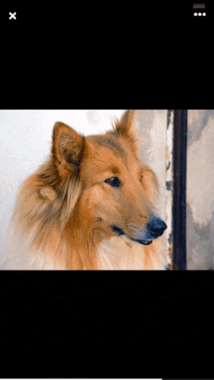
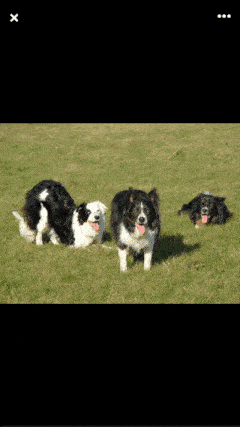
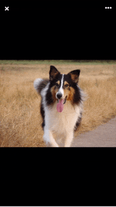
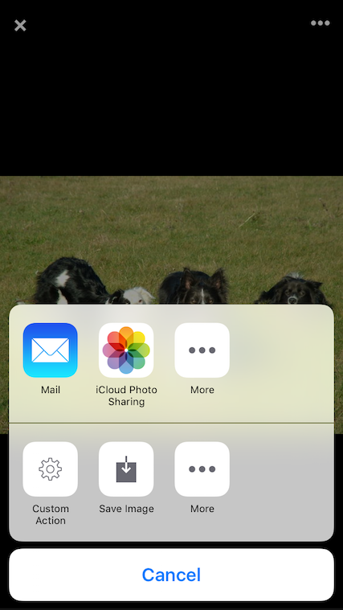

# CollieGallery

[](http://cocoapods.org/pods/CollieGallery)
[](http://cocoapods.org/pods/CollieGallery)
[](http://cocoapods.org/pods/CollieGallery)

CollieGallery is a fullscreen image gallery with support for local and remote images and it has a lot of built-in features like zooming, panning, interactive transitions and more! The gallery is highly customizable and it’s really easy to make it look and work the way you want.

 

 

## Installation

CollieGallery is available through [CocoaPods](http://cocoapods.org). To install
it, simply add the following line to your Podfile:

```ruby
pod "CollieGallery"
```

## Usage

CollieGallery is really easy to use! You just need to follow these steps:

1. Import the CollieGallery module:

	```swift
	import CollieGallery
	``` 
2. Create an array to hold the pictures:

	```swift
	var pictures = [CollieGalleryPicture]()
	```
3. Add all the pictures that should be displayed in the gallery to the array. You can create a picture object from an UIImage or from a String representing the remote image url:

	* Creating from an UIImage:
	
		```swift
		let image = UIImage(named: "example")!
		
		let picture = CollieGalleryPicture(image: image)
		pictures.append(picture)
		
		let pictureWithCaption = CollieGalleryPicture(image: image, title: "Collie Picuture", caption: "Picture with caption"))
		pictures.append(pictureWithCaption)
		```
		
	* Creating from a remote url:
		
		```swift
		let url = "http://example.com/picture.jpg"
		let picture = CollieGalleryPicture(url: url)
		pictures.append(picture)
		```
4. Create a gallery with the pictures:

	```swift
	let gallery = CollieGallery(pictures: pictures)
	```
5. Show the gallery in the current view controller:

	```swift
	gallery.presentInViewController(self)
	```
6. You can also scroll to the desired page by index:

	```swift
	gallery.scrollToIndex(5)
	```

## Delegate Functions

* CollieGalleryDelegate:

```swift
optional func gallery(gallery: CollieGallery, indexChangedTo index: Int)
```

## Customization

### Options

The available options for customization are:

* *parallaxFactor*: The amount of the parallax effect from 0 to 1.
* *enableZoom*: Indicates weather the pictures can be zoomed or not.
* *maximumZoomScale*: The maximum scale that images can reach when zoomed.
* *showProgress*: Indicates weather the progress should be displayed or not.
* *preLoadedImages*: The amount of pictures that should be preloaded next to the current displayed picture.
* *gapBetweenPages*: The space between each scrollview's page.
* *enableSave*: Indicates if the user should be able to save the picture.
* *enableInteractiveDismiss*: Indicates if the user should be able to dismiss the gallery interactively with a pan gesture.
* *customActions*: Array with your custom actions that will be displayed in the actions dialog.
* *excludedActions*: Array with the system actions that should not be displayed in the actions dialog.


To change the way CollieGallery works you should use the CollieGalleryOptions class. You can change the options in two ways:

1. Use the sharedOptions object. All the changes made in the sharedOptions will affect all new instances of the gallery. For example, if you set the enableZoom property to false, all new instances will have the picture zoom disabled:

	```swift
	CollieGalleryOptions.sharedOptions.enableZoom = false
	```
2. Create a new CollieGalleryOptions object, customize it and pass as the second parameter in the CollieGallery initializer:

	```swift
	let options = CollieGalleryOptions()
	options.enableZoom = false
	
	let gallery = CollieGallery(pictures: pictures, options: options)
	```

### Appearance

The available options for appearance customization are:

* *backgroundColor*: The background color of the gallery.
* *progressBarColor*: The color of current progress in the progress bar.
* *activityIndicatorColor*: The color of the activity indicator.
* *closeButtonColor*: The color of the close button icon.
* *actionButtonColor*: The color of the action button icon.

To change the way CollieGallery looks you should use the CollieGalleryAppearance class. You can change the gallery appearance in two ways:

1. Use the sharedAppearance object. All the changes made in the sharedAppearance will affect all new instances of the gallery. For example, if you set the backgroundColor property to blue, all new instances will have a blue background:

	```swift
	CollieGalleryAppearance.sharedAppearance.backgroundColor = UIColor.blueColor()
	```
2. Use the CollieGalleryTheme class. You can use one of the pre-defined themes or you create your theme and pass it as the third parameter in the CollieGallery initializer:

	* Pre-defined themes:

		```swift
		let gallery = CollieGallery(pictures: pictures, options: nil, theme: CollieGalleryTheme.Dark)
		```
	* Custom theme:
	
		```swift
		let appearance = CollieGalleryAppearance()
		appearance.backgroundColor = UIColor.blueColor()
		
		let theme = CollieGalleryTheme(appearance: appearance)
		
		let gallery = CollieGallery(pictures: pictures, options: nil, theme: theme)
		```

### Transitions

To change the transition that is used to present and dismiss the gallery you should use the CollieGalleryTransitionType class. You can pass one of the available transition types as the second parameter of the presentInViewController function:

```swift
gallery.presentInViewController(self, CollieGalleryTransitionType.Default)
```

#### Zoom Transition


To use the zoom transition you need to folow these steps:

1. Indicate that your view controller will implement the `CollieGalleryZoomTransitionDelegate`:

	```swift
	class ViewController: UIViewController, CollieGalleryZoomTransitionDelegate {
	```
2. Implement the `CollieGalleryZoomTransitionDelegate` methods:

	- Indicate the bounds where the image could be dismissed with the zoom effect:
	
		```swift
		func zoomTransitionContainerBounds() -> CGRect {
			return self.view.frame
		}
		```
	- Indicate to which view the picture will be zoomed out when dismissed:
	
		```swift
		func zoomTransitionViewToDismissForIndex(index: Int) -> UIView?
			return self.imageViews[index]
		}
		```
3. Present the gallery indicating from which view the gallery will be zoomed in and passing the view controller as delegate:

	```swift
	let zoomTransition = CollieGalleryTransitionType.Zoom(fromView: aView, zoomTransitionDelegate: self)
	gallery.presentInViewController(self, transitionType: zoomTransition)
	```

### Custom Actions



To create your own actions just follow the next example:

```swift
let options = CollieGalleryOptions()

let customAction = CollieGalleryCustomAction(title: "Custom Action", imageName: "imageName") { () -> () in
    print("Custom Action Tapped!")
}

options.customActions = [customAction]

let gallery = CollieGallery(pictures: pictures, options: options)
```


### Excluded Actions

To remove default actions from the dialog just follow the next example:

```swift
let options = CollieGalleryOptions()
        
let customAction = CollieGalleryCustomAction(title: "Custom Action", imageName: "settings") { () -> () in
    print("Custom Action Tapped!")
}

options.excludedActions = [UIActivityTypeAssignToContact, UIActivityTypeCopyToPasteboard, UIActivityTypePrint]

let gallery = CollieGallery(pictures: pictures, options: options)
```

## Requirements

* iOS 8.0

## Changelog

See [`CHANGELOG.md`](https://github.com/gmunhoz/CollieGallery/blob/master/CHANGELOG.md).

## Author

Guilherme Munhoz, g.araujo.munhoz@gmail.com

## License

CollieGallery is available under the MIT license. See the LICENSE file for more info.
